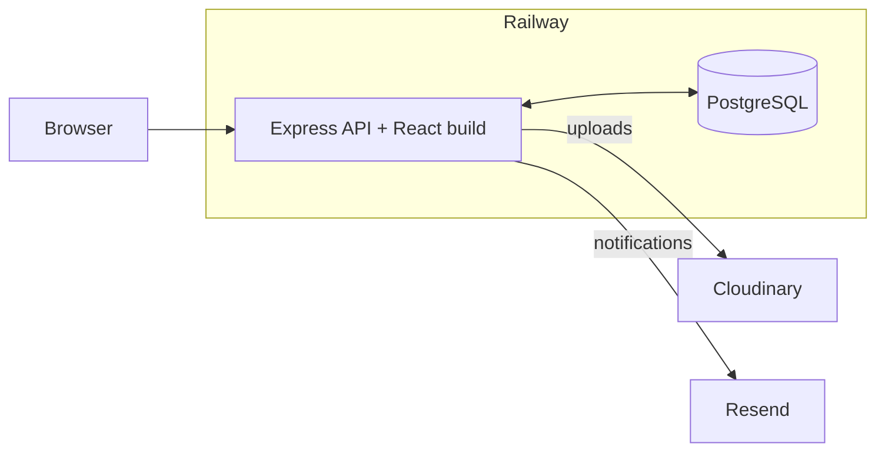

# The Yonatan Times - Professional Developer's Chronicle

<div align="center">


*A sophisticated newspaper-style portfolio showcasing the professional journey of an aspiring developer — now with its own newsroom.*

[💼 LinkedIn](https://www.linkedin.com/in/yonatan-berihun) | [🐙 GitHub](https://github.com/Yoni-Berihun)

</div>

---

## Project Overview

**The Yonatan Times** is an interactive newspaper-style portfolio that chronicles the professional journey of **Yonatan Berihun**, an aspiring developer and Information Systems student at Hawassa University. It began as a professional submission for the **PLP Academy July 2025 Portfolio Challenge**.

The design has not changed. What changed is everything behind it: the site is a **full-stack application with its own content management system**, so new projects, awards and articles are published from a browser instead of a code editor.

### Key Highlights

- **Identical newspaper aesthetic** — typography, rules, columns and masthead
- **Editable from anywhere** — private `/admin` newsroom for every piece of content
- **Sections you can invent** — add, reorder, hide or delete without a deployment
- **A real publication** — blog with categories, tags, related reading and RSS
- **Type-safe from database to browser** — TypeScript + Prisma

---

## Architecture



**One Railway service** serves the API and the Vite-built React app from the same origin. The admin session cookie stays first-party — no Vercel rewrite, no CORS in production.

**Images never touch the API disk.** Uploads go to Cloudinary and are served from its CDN.

---

## The Newsroom (`/admin`)

| Area | What you can do |
|---|---|
| **Overview** | Sections, articles, drafts and unread messages |
| **Sections** | Create, reorder, rename, hide or delete |
| **Projects / Skills / Timeline / Accolades / Impact** | Full CRUD editors |
| **The Edition** | Markdown articles, categories, tags, SEO |
| **Media** | Upload and reuse images |
| **Inbox** | Contact form submissions |
| **Settings** | Masthead, bio, portrait, social links, password |

---

## Tech Stack

- **React 19**, **Vite**, **React Router 7**, **TanStack Query**
- **Express 5**, **Prisma 6**, **PostgreSQL**, **Zod**
- **Cloudinary**, **Resend**
- **Railway** — single service + Postgres

---

## Project Structure

```
yonatan-times/
├── server/                 # Express API (+ serves web/dist in production)
│   ├── prisma/
│   └── src/
├── web/                    # React public site + /admin
├── images/                 # Seeded portfolio images
├── railway.toml            # Railway build/start
├── DEPLOYMENT.md           # Click-by-click Railway guide
└── index.html              # Original static edition (reference)
```

---

## Local development

### Prerequisites

- Node.js 20+
- PostgreSQL (a free [Neon](https://neon.tech) project works)
- Optional: Cloudinary + Resend

```bash
git clone <your-repo-url> yonatan-times
cd yonatan-times

npm run install:all
npm install --include=dev

cd server
cp .env.example .env      # fill DATABASE_URL and JWT_SECRET
npx prisma migrate dev
npm run seed
cd ..

npm run dev
```

- **http://localhost:5173** — public newspaper (Vite proxies `/api` → `:4000`)
- **http://localhost:5173/admin** — newsroom

On first API start, if `ADMIN_PASSWORD` is blank, a generated password is printed **once** in the console.

| Command | What it does |
|---|---|
| `npm run dev` | API + site together |
| `npm run seed` | Re-import baseline content (safe to repeat) |
| `npm run build` | Production build used by Railway |
| `npm run typecheck` | Type-check server and web |

---

## Deployment

Full instructions: **[DEPLOYMENT.md](DEPLOYMENT.md)**.

Short version:

1. Push this repo to GitHub
2. Railway → Deploy from GitHub → add Postgres
3. Set env vars (`JWT_SECRET`, admin, Cloudinary, Resend, `PUBLIC_SITE_URL`)
4. Set `RUN_SEED=true` once, deploy, copy admin password from logs
5. Clear `RUN_SEED`, open `/` and `/admin`

---

## Design Philosophy

The stylesheet from the static edition is used **unmodified**. New styles live in separate files and reuse the same design tokens.

---

## Author

**Yonatan Berihun** — Relentless Developer | Mentor | Impact Through Technology

- GitHub: [@Yoni-Berihun](https://github.com/Yoni-Berihun)
- LinkedIn: [yonatan-berihun](https://www.linkedin.com/in/yonatan-berihun)

---

## License

See [LICENSE](LICENSE).
