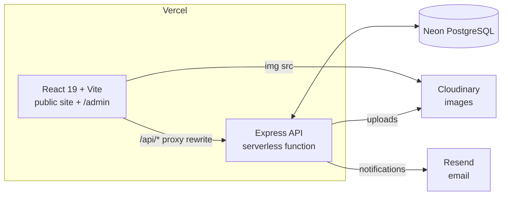

# The Yonatan Times - Professional Developer's chronicle

<div align="center">


*A sophisticated newspaper-style portfolio showcasing the professional journey of an aspiring developer — now with its own newsroom.*

[🌐 Live Demo](https://yoni-berihun.netlify.app) | [💼 LinkedIn](https://www.linkedin.com/in/yonatan-berihun) | [🐙 GitHub](https://github.com/Yoni-Berihun)

</div>

---

## 📰 Project Overview

**The Yonatan Times** is an interactive newspaper-style portfolio that chronicles the professional journey of **Yonatan Berihun**, an aspiring developer and Information Systems student at Hawassa University. It began as a professional submission for the **PLP Academy July 2025 Portfolio Challenge**.

### 🎯 Project Vision

This portfolio transforms the traditional developer portfolio into a sophisticated newspaper format, combining journalistic storytelling with technical expertise. **Inspired by the New York Times newspaper design philosophy**, it aims to be creative while maintaining professional standards.

The design has not changed. What changed is everything behind it: the site is now a **full-stack application with its own content management system**, so new projects, awards and articles are published from a browser instead of a code editor.

### 🌟 Key Highlights

- **Identical newspaper aesthetic** — the same typography, rules, columns and masthead as the original hand-written edition
- **Editable from anywhere** — a private `/admin` newsroom for every piece of content on the page
- **Sections you can invent** — add, reorder, hide or delete whole page sections without a deployment
- **A real publication** — "The Latest Edition" is a full blog with categories, tags, related reading and an RSS feed
- **Built for discovery** — server-rendered metadata, structured data, a live sitemap and working link previews
- **Type-safe from database to browser** — TypeScript throughout, with Prisma-generated types

---

## 🏗️ Architecture



Two deliberate decisions are worth calling out:

**The frontend proxies the API through its own domain.** Vercel rewrites `/api/*` to the serverless API project, so the browser only ever sees one origin. This keeps the admin session cookie first-party — Safari and Firefox block third-party cookies outright, which would otherwise break login entirely — and it means CORS never enters the picture in production.

**Images never touch the API filesystem.** Vercel Functions are ephemeral, so uploads go straight to Cloudinary and are served from its CDN with automatic WebP conversion and resizing.

---

## ✨ Features & Capabilities

### 🎨 Design & User Experience

- **Newspaper aesthetic**: authentic layout with masthead, dateline and editorial sections
- **Responsive design**: fully responsive across desktop, tablet and mobile
- **Professional typography**: Playfair Display and Merriweather
- **Accessible navigation**: keyboard-operable menu, focus states, `aria` labels, and an Escape key that closes the mobile drawer

### 📝 The Newsroom (`/admin`)

| Area | What you can do |
|---|---|
| **Overview** | Counts of sections, articles, drafts and unread messages at a glance |
| **Sections** | Create, reorder, rename, hide or delete page sections |
| **Projects** | Full editing with screenshots, tech tags, links and an archived state |
| **Skills** | Manage columns and the written entries inside them |
| **Timeline** | Dated journey entries with logos, plus the "By the Numbers" statistics |
| **Accolades** | Certificates and awards shown in the carousel |
| **The Edition** | Write articles in Markdown with live preview, categories, tags, related reading and per-article SEO |
| **Media** | Upload and reuse images; copy URLs; delete what you no longer need |
| **Inbox** | Read, archive and reply to contact form submissions |
| **Settings** | Masthead, biography, portrait, footer, social links and your password |

### 🗞️ The Latest Edition (blog)

- Markdown articles with newspaper typography, including a drop cap on the opening paragraph
- Categories and tags, each with its own filtered listing
- Curated related reading, with an automatic same-category fallback
- Full-text search across titles, standfirsts and bodies
- Draft and published states, plus a "front page" feature flag
- A live RSS feed at `/rss.xml` and a sitemap at `/sitemap.xml`
- Reading time and view counts calculated automatically

### 🔒 Security

- Passwords hashed with bcrypt at cost 12; the login path compares against a dummy hash for unknown accounts so response timing reveals nothing
- Sessions in `httpOnly`, `sameSite` cookies — never in `localStorage`, so a script injection cannot steal them
- Rate limiting on sign-in (10 attempts per 15 minutes) and on the contact form (5 per hour)
- A honeypot field on the contact form that silently accepts bot submissions
- Visitor IPs stored only as truncated SHA-256 hashes
- `/admin` marked `noindex` and disallowed in `robots.txt`
- Every request body validated with Zod before it reaches the database

---

## 🛠️ Technology Stack

### Frontend

- **React 19** with **TypeScript** and **Vite**
- **React Router 7** for routing, with the admin and article pages code-split so visitors never download them unnecessarily
- **TanStack Query** for data fetching, caching and optimistic invalidation
- **React 19 native document metadata** — `<title>` and `<meta>` are rendered as ordinary components, so no helmet library is needed
- **react-markdown** with GitHub Flavored Markdown

### Backend

- **Node.js** and **Express 5** in TypeScript
- **Prisma 6** with **PostgreSQL**
- **Zod** for environment and request validation
- **bcrypt** and **JWT** for authentication
- **Cloudinary** for image storage and delivery
- **Resend** for contact notifications

### Deployment

- **Vercel** — separate frontend and serverless Express API projects
- **Neon** — pooled PostgreSQL for serverless-safe connections
- Publishing content pings a **Vercel deploy hook**, which rebuilds the prerendered metadata so new articles are immediately shareable

---

## 📁 Project Structure

```
Yonatan-Developer-Chronicle/
├── server/                      # Express API → Vercel Function
│   ├── api/index.ts             # Serverless entrypoint
│   ├── vercel.json              # API routing/build config
│   ├── prisma/
│   │   ├── schema.prisma        # The complete data model
│   │   └── seed.ts              # Imports the original index.html content
│   └── src/
│       ├── app.ts               # Middleware and route mounting
│       ├── index.ts             # Startup and graceful shutdown
│       ├── env.ts               # Fail-fast environment validation
│       ├── bootstrap.ts         # Creates the first admin account
│       ├── lib/                 # Prisma, Cloudinary, mail, slugs, errors
│       ├── middleware/          # Auth, validation, error handling
│       └── routes/              # Public, auth, feeds and admin endpoints
│
├── web/                         # React application → Vercel
│   ├── scripts/prerender.mjs    # Bakes metadata into static HTML
│   ├── public/images/           # Original image assets
│   └── src/
│       ├── components/          # Masthead, header, footer, sections
│       ├── pages/               # Home, blog index, article, 404
│       ├── admin/               # The newsroom
│       ├── lib/                 # API client, types, formatting
│       └── styles/
│           ├── newspaper.css    # The original stylesheet, unchanged
│           ├── additions.css    # Blog and new-state styles
│           └── admin.css        # The newsroom interface
│
├── DEPLOYMENT.md                # Step-by-step deployment guide
└── index.html                   # The original static edition, kept for reference
```

---

## 🚀 Getting Started

### Prerequisites

- **Node.js 20 or newer**
- A **PostgreSQL** database — a free [Neon](https://neon.tech) project is the quickest way to get one for local work
- Optional: [Cloudinary](https://cloudinary.com) and [Resend](https://resend.com) accounts for uploads and email

### Local development

```bash
git clone https://github.com/Yoni-Berihun/Yonatan-Developer-Chronicle.git
cd Yonatan-Developer-Chronicle

# Install both packages.
# --include=dev is passed explicitly because some npm setups (and any
# environment with NODE_ENV=production) skip devDependencies by default.
npm run install:all
npm install --include=dev

# Configure the API
cd server
cp .env.example .env      # then fill in DATABASE_URL and JWT_SECRET

# Create the tables and import the existing portfolio content
npx prisma migrate dev --name init
npm run seed
cd ..

# Run the API on :4000 and the site on :5173 together
npm install
npm run dev
```

Then open:

- **http://localhost:5173** — the public newspaper
- **http://localhost:5173/admin** — the newsroom

On its very first start the API creates your admin account. If you left `ADMIN_PASSWORD` blank it generates one and prints it to the console **once** — copy it before the log scrolls away.

### Useful commands

| Command | Where | What it does |
|---|---|---|
| `npm run dev` | root | Runs the API and the site together |
| `npm run seed` | root | Re-imports the baseline content (safe to repeat) |
| `npm run studio` | `server` | Opens Prisma Studio to browse the database |
| `npm run migrate:dev` | `server` | Creates a migration after a schema change |
| `npm run typecheck` | either | Type-checks without emitting files |
| `npm run build` | `web` | Production build plus the prerender step |

---

## 🌐 Deployment

Full instructions live in **[DEPLOYMENT.md](DEPLOYMENT.md)**. The short version:

1. Create a pooled Neon PostgreSQL database and run committed migrations
2. Deploy `server/` as a Vercel project using the **Other** framework preset
3. Deploy `web/` as a second Vercel project using the **Vite** preset
4. Set the backend URL in `web/vercel.json`, then configure the frontend deploy hook
5. Seed once, verify `/health`, `/admin`, `/version.json`, RSS and sitemap

Both Vercel projects, Neon, Cloudinary and Resend can start on free tiers.

---

## 🎨 Design Philosophy

### Newspaper aesthetic

- **Typography**: serif fonts for an authentic newspaper feel
- **Layout**: traditional column structure with generous whitespace
- **Colour**: paper tones with restrained blue and red accents
- **Hierarchy**: clear organisation that rewards scanning and reading alike

### Preserving the original

The stylesheet from the static edition is used **unmodified**. New styles live in a separate file and reuse the same design tokens, so anything added later inherits the same paper. Where the React version differs, it is because a behaviour was broken before — the mobile menu's close animation never fired in the CSS-only version, because the label sat outside the checkbox's sibling scope.

---

## 🚀 Future Enhancements

- **Print stylesheet** for a genuinely printable edition
- **Dark mode** as an evening edition
- **Newsletter** subscriptions on top of the existing Resend integration
- **Analytics** to see which articles and projects draw attention
- **Scheduled publishing** so articles can be queued in advance
- **Image alt-text prompts** in the admin to keep accessibility honest

---

## 📞 Contact Information

- **💼 LinkedIn**: [Yonatan Berihun](https://www.linkedin.com/in/yonatan-berihun)
- **🐙 GitHub**: [Yoni-Berihun](https://github.com/Yoni-Berihun)
- **📧 Email**: yonatanberihun26@gmail.com

---

## 📄 License & Attribution

This project is licensed under the MIT License. See the [LICENSE](LICENSE) file for details.

### Acknowledgments

- **PLP Academy Team**: Special thanks to the PLP Academy team for organizing the July 2025 cohort software development scholarships and hosting this amazing hackathon for cohort members. Your support and guidance have been invaluable in this learning journey.
- **Google Fonts**: Playfair Display and Merriweather typography
- **Hawassa University**: Educational background and institutional support

---

<div align="center">

**The Yonatan Times** — Where code meets journalism, and innovation meets tradition.

*Built with ❤️ using React, TypeScript, Express and PostgreSQL*

</div>
